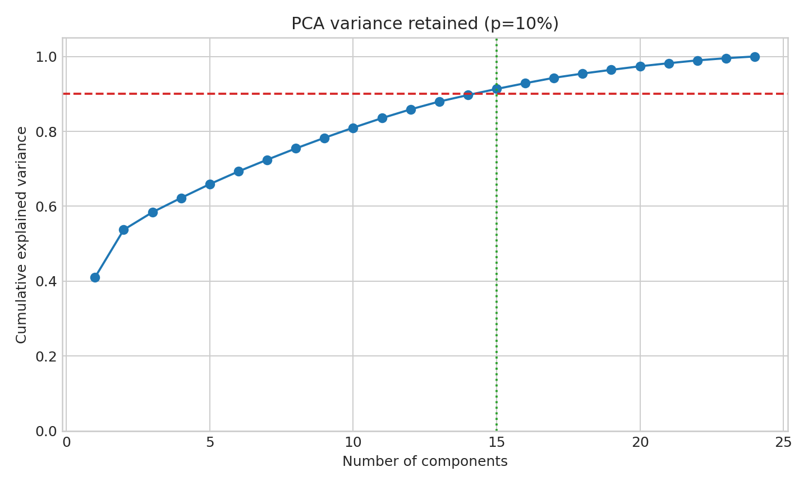
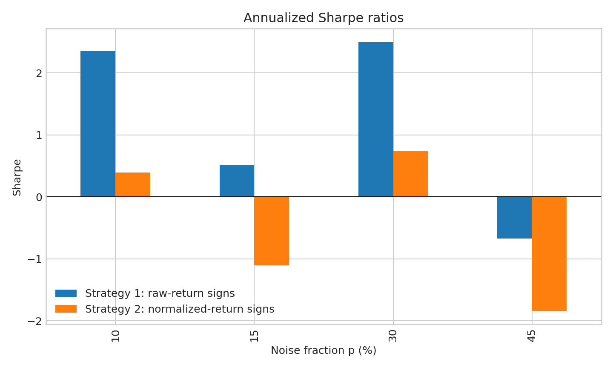

# Independent Replication of PCA + HMM Stock-Return Forecasting

An auditable implementation inspired by Eugene W. Park (2023), [*Principal
Component Analysis and Hidden Markov Model for Forecasting Stock Returns*](https://arxiv.org/abs/2307.00459).

## Research question

Can a small number of PCA factors and a Gaussian hidden Markov model forecast
the direction of stock returns well enough to improve risk-adjusted portfolio
performance?

## What the paper does

The paper follows this pipeline:

```text
weekly stock returns
        -> standardisation and PCA
        -> retain the largest eigenvalue directions
        -> Gaussian HMM on factor returns
        -> one-step factor forecast
        -> reconstruct individual-stock forecasts
        -> directional accuracy and trading backtest
```

PCA reduces the dimensionality of the S&P 500 cross-section. The HMM then
models an unobserved Markov state behind the factor-return observations. The
paper evaluates four noise-removal fractions, labelled `p`, and compares two
equal-weight forecast-based strategies with buy-and-hold.

## What is implemented here

- Standardised covariance PCA with deterministic eigenvector signs
- Variance-threshold component selection for `p = 45%, 30%, 15%, 10%`
- A transparent diagonal-covariance Gaussian HMM fitted with Baum-Welch EM
- Viterbi state inference and the paper's transition-weighted forecast
- Reconstruction of factor forecasts into asset-return forecasts
- Strategy 1: long positive raw-return forecasts and short negative forecasts
- Strategy 2: the same rule using normalized-return forecasts
- Equal-weight buy-and-hold benchmark
- Directional accuracy, cumulative return, and annualized Sharpe ratio
- A paper-results transcription and reproducibility audit
- Unit tests for the PCA, HMM, and rolling backtest components

## Reproducibility boundary

This is a **critical, paper-inspired replication**, not a claim of exact
numeric reproduction. The paper does not provide the original ticker list,
download snapshot, random seeds, full HMM implementation, or executable code.
It also acknowledges survivor bias and assumes zero transaction costs and
trading exactly at the weekly close.

The default run therefore uses a deterministic synthetic regime-switching
return panel. This makes the complete pipeline runnable offline and tests the
algorithm itself. To use real data, place a clean return CSV in `data/` and
call `load_returns_csv` from `src/data.py`; the expected layout is one date
column followed by one return column per asset.

The repository keeps the paper's reported Tables 1 and 2 separately in
`results/paper_reported_results.csv`. We do not overwrite those numbers with
our own results or imply that a synthetic run validates the S&P 500 claim.

## Demonstration output

The quick deterministic run uses 260 training weeks, 20 forecast weeks, 24
synthetic assets, and candidate HMM state counts 2–4. Its results are
illustrative only. For example, the current run gives the following strategy
summary:

| Noise removed `p` | Strategy | Annualized Sharpe | Cumulative return |
| ---: | --- | ---: | ---: |
| 45% | Raw-return signs | -0.672 | -1.40% |
| 30% | Raw-return signs | 2.499 | 5.26% |
| 15% | Raw-return signs | 0.508 | 0.92% |
| 10% | Raw-return signs | 2.350 | 4.23% |

The variation across `p` is the point: hyperparameter choice materially
changes the result. It is not evidence that one setting will outperform in
live markets.





## Repository structure

```text
notebooks/
  00_research_design.ipynb
  01_pca_factor_model.ipynb
  02_gaussian_hmm.ipynb
  03_replication_results.ipynb
src/
  data.py
  pca_hmm.py
  strategies.py
  replication.py
tests/
  test_pca_hmm.py
docs/
  MATH_GUIDE.md
  PAPER_AUDIT.md
  PROJECT_DEFENCE.md
  GITHUB_WORKFLOW.md
results/
  paper_reported_results.csv
  replication_results.csv
  strategy_summary.csv
  figures/
run_replication.py
requirements.txt
```

## Run locally

From Anaconda Prompt:

```bash
conda activate paper_env
cd "C:\Users\user\Documents\GitHub\pca-hmm-stock-return-replication"
python -m pip install -r requirements.txt
python run_replication.py
python -m pytest -q
```

For a paper-shaped 520-week training window and 100-week forecast window on
the offline synthetic panel:

```bash
python run_replication.py --paper-like
```

Open the notebooks in numerical order and select the `paper_env` kernel.

## Reproducibility choices

- Weekly observations, matching the paper's frequency.
- Rolling one-period-ahead forecasts.
- PCA component count is the smallest `k` retaining at least `1 - p` variance.
- HMM state candidates default to 2, 3, and 4 for a quick run; the paper
  searches 2 through 8 and that range can be passed to the library functions.
- Diagonal Gaussian emissions, deterministic random seeds, and explicit
  parameter counting for AIC.
- No transaction costs, slippage, or market-impact assumptions in the
  paper-style benchmark; these are documented limitations, not hidden code.

## Skills demonstrated

- Eigen-decomposition and dimensionality reduction
- Linking PCA factors to a factor-model reconstruction
- Markov transition probabilities and latent-state inference
- Baum-Welch EM and Viterbi decoding
- Rolling out-of-sample forecasting
- Portfolio construction and Sharpe-ratio evaluation
- Reproducibility auditing and honest treatment of missing information

## Scope

This is an educational computational-research project, not financial advice.
Backtest results are sensitive to data history, universe construction,
transaction costs, execution assumptions, and hyperparameter selection.

## Reference

Park, E. W. (2023). *Principal Component Analysis and Hidden Markov Model for
Forecasting Stock Returns*. arXiv:2307.00459.
